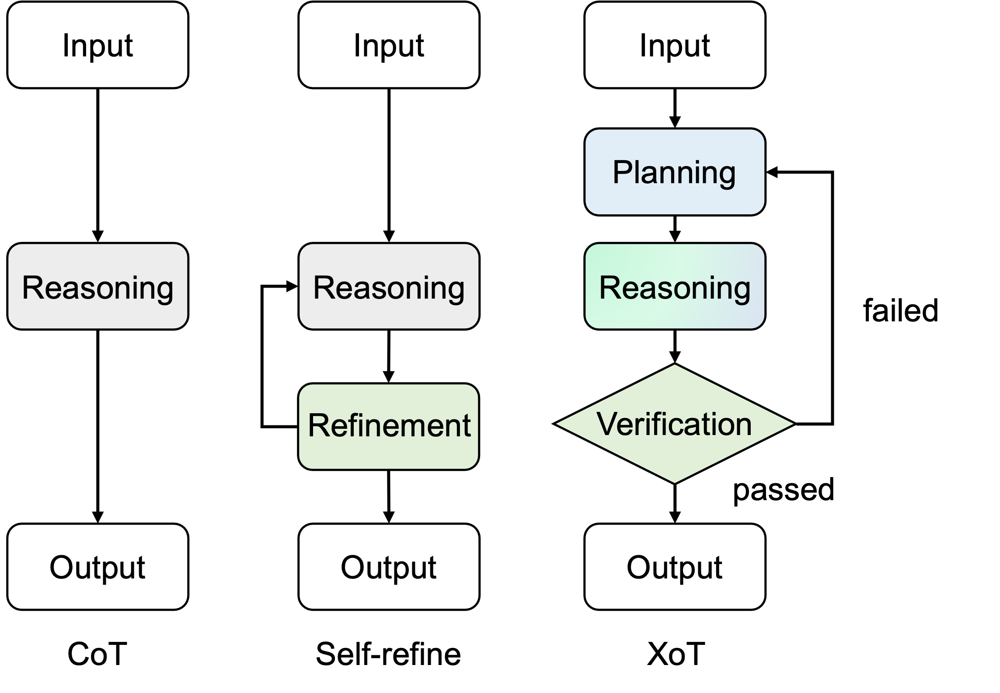

# Pattern Recognition Project - Plan, Verify and Switch: Integrated Reasoning with Diverse X-of-Thoughts

Reproducibility study and extension of the work in the [paper](https://arxiv.org/pdf/2310.14628.pdf).
Original code can be found at this [repository](https://github.com/tengxiaoliu/XoT).




## Install dependencies

Install all the dependencies in the requirements.txt file:
```
pip install -r requirements.txt
```

## Run the code

### Generate XoT results for GSM8K dataset with the Phi-2 model

Run the following command to generate the results for the initial modules, for the total GSM8K dataset:
```
bash scripts/run_gsm.sh 0 end
```

This will produce 6 files in the `outputs/gsm` folder.

Run the following command to additionally generate the results for the metacognitive evaluation for CoT, the updated plan module, the ToT module and the metacognitive evaluation for ToT, for the total GSM8K dataset:
```
bash scripts/run_extensions_gsm.sh 0 end
```

This will produce 2 files in the `outputs/gsm` folder.


### Evaluate and Analyze

To evaluate and analyze the generated XoT results, the initial `analyze.py` is used. To run the script, use the command:
```
bash scripts/eval_gsm.sh
```

To evaluate the first extension (metacognitive evaluation of CoT and the updated plan module), the `analyze_extension1.py` is used. To run the script, use the command:
```
bash scripts/eval_extension1_gsm.sh
```

To evaluate the second extension (incorporation of the ToT prompting method) with the initial plan module and without metacognitive evaluation, the `analyze_extension2a.py` is used. To run the script, use the command:
```
bash scripts/eval_extension2a_gsm.sh
```

To evaluate the second extension (incorporation of the ToT prompting method) with metacognitive evaluation and the updated plan module, the `analyze_extension2b.py` is used. To run the script, use the command:
```
bash scripts/eval_extension2b_gsm.sh
```

You can also directly run the analyses with the above commands using the output files we produced in the `outputs/gsm` folder.
